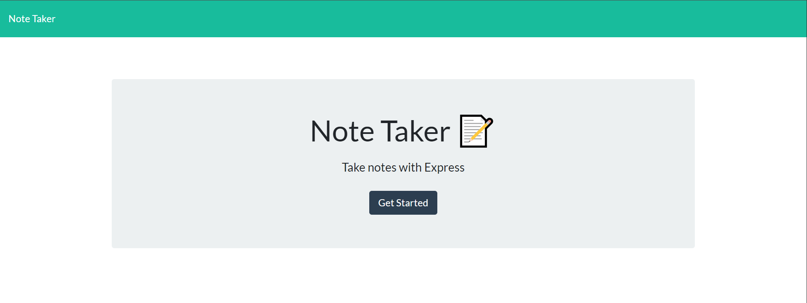
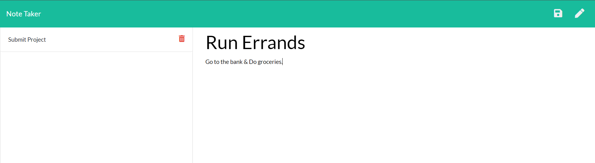
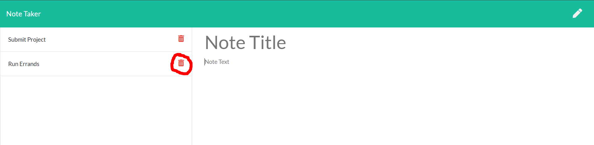
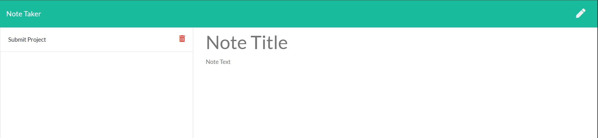

# Note Taker [](http://unlicense.org/)

## Description
* Note Taker is your standard note-taking application that allows to you create, save, and delete notes. To create a note, add a Title and Description. For example: you can create a Task titled Homework, and include a description for the steps of your task at hand. This application utilizes Express.js to retrieve, create, and delete data from a JSON.file. Note Taker is deployed through Heroku.

## Table of Contents
1. [Description](#description)
2. [Technologies](#Technologies)
3. [Installation](#installation)
4. [Usage](#usage)
5. [Screenshots](#Screenshots)
6. [License](#License)
7. [Contributing](#Contributing)
8. [Author](#Author)

## Technologies
* JavaScript
* NPM Packages: (express, uuid)
* Bootstrap / CSS
* HTML

## Installation
1. Clone the repo locally
```
  $ git clone <SSH Link>
```
2. Install npm packages at root of application
```
  $ npm install
```

## Usage (Heroku)
1. Visit this [Heroku Link](https://ronan-note-taker.herokuapp.com/) to access the live app.
2. Click "Get Started" to start creating notes or delete previous ones.

## Screenshots
1. Click "Get Started" to begin.


2. Click on the pencil icon at the upper-right corner to create a new note. Insert a Note Title and Note Text, as shown below.


3. You can delete a note by clicking its red trash icon as highlighted in the screenshot below.


4. This last screenshot shows that the "Run Errands" note was succesfully deleted.



## License
This project is in the public domain and free for any and all users! For more information on this (un)licensing statement, visit [unlicense.org](https://unlicense.org/).

## Contributing
* If you'd like to contribute to this project, please follow the rules of the [Contributor Covenant](https://www.contributor-covenant.org/).

## Author
* This application was written and developed by Ronan Galvez. This assignment is part of the UCF Coding Bootcamp's project requirements.
* For any questions/suggestions/concerns, open an issue in the [project repo](https://github.com/galv-ronan/note-taker.git) or contact me directly at [galv.ronan@gmail.com](galv.ronan@gmail.com).
* Check out the rest of my work on GitHub at [Ronan-Codes](https://github.com/Ronan-Codes).
